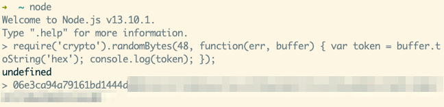

# SunshineWaiter

## Setting up environmental variables

In directory `/backend/`, copy `.env_file_template` to `.env_file`.
Keep your secret string in it.
You can generate a secret string by running this code in node.js:

```javascript
require('crypto').randomBytes(48, function(err, buffer) {
	var token = buffer.toString('hex');
	console.log(token);
});
```

like this:



## How to Run with Docker

### Build, Setup and Configure

#### Run with Docker

##### First-time setup

1. Open a terminal and `git clone` this [repository](https://github.com/unsw-cse-comp3900-9900/capstone-project-sunshine-waiter)
2. Install [Docker](https://www.docker.com/products/docker-desktop), and create an account if no
3. After installation, launch docker in your computer
4. After docker is running and up in your computer, open a terminal and`cd` to the root directory of this project(same directory with `docker-compose.yml`)
    > By default, the `backend/.env_file` file will be cloned together from the repository, but just in case that if there is no such file in the backend folder, just create one and copy and paste the following content in it:
    >
    > ```javascript
    > SW_JWT_SECRET = asdfdasfajsldfjdsjfjkljsfdjaklsdfjkladsjfklasdjflkjkljdakfjaldsfjlerioqueoirudgncn;
    > MONGO_INITDB_ROOT_USERNAME = ROOT_USERNAME;
    > MONGO_INITDB_ROOT_PASSWORD = ROOT_PASSWORD;
    > ```
5. Run `docker-compose up --build` to build and run this project
6. After everything is built, go to `http://localhost:3000`

##### Subsequence runs

1. Run `docker-compose up` in your terminal (make sure the docker is up in your computer, otherwise the docker command will not working)
2. Go to `http://localhost:3000`

### Play around our system and functionalities

#### Before using our system

##### 1. Create Multiple profiles

Due to the persist-login functionality in our system, a chrome profile can only persist a user's cookie from SW website. So it is better to create multiple profiles in chrome and run our website to avoid the situation that logging in one more user will kick out the current user.

Reason to have this multiple profiles to play around our web application is that our web application has all kinds of interaction between different roles.

Way to create profile in Chrome, [click here](https://www.bettercloud.com/monitor/the-academy/how-to-create-switch-profiles-in-chrome/)

##### 2. Generate and Use our dummy data if you want

-   After the system is up, type the following code to initiate dummy data

```
curl http://localhost:8000/dbinit
```

-   This will generate hundreds of SW users and thousands of history order records which is enough for sales analysis in dashboard in the manager page
-   All users information can be found in `dummyUsers.json` for the sake of login

##### 3. Play around with your own create data

-   Please follow the video guide below to create your own mock-up data step by step

#### Video Guides

##### 1. [How to create a restaurant, build menu and invite staffs](https://youtu.be/eb3eQ_ZZ1xo)

##### 2. [How to make an order](https://www.youtube.com/watch?v=3I23qQJmjWQ)

##### 3. [Sales analysis section](https://www.youtube.com/watch?v=BgWIriECzFo)
