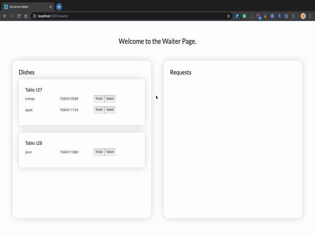
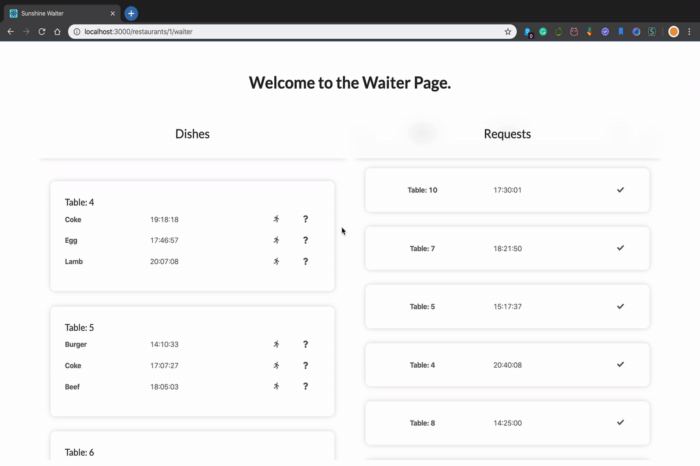
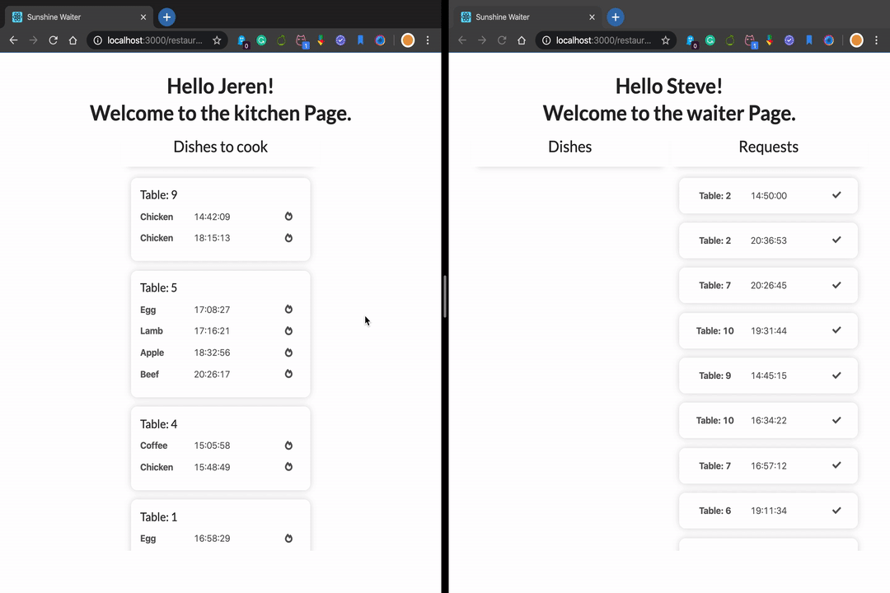
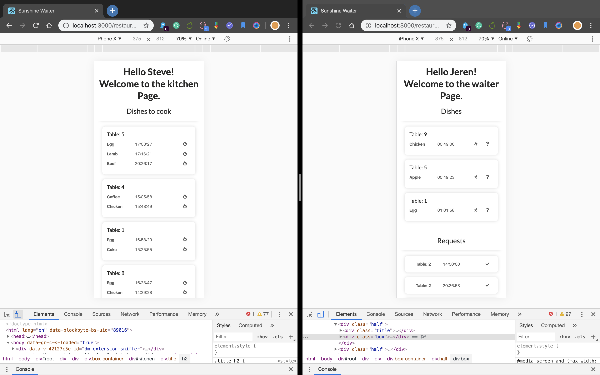
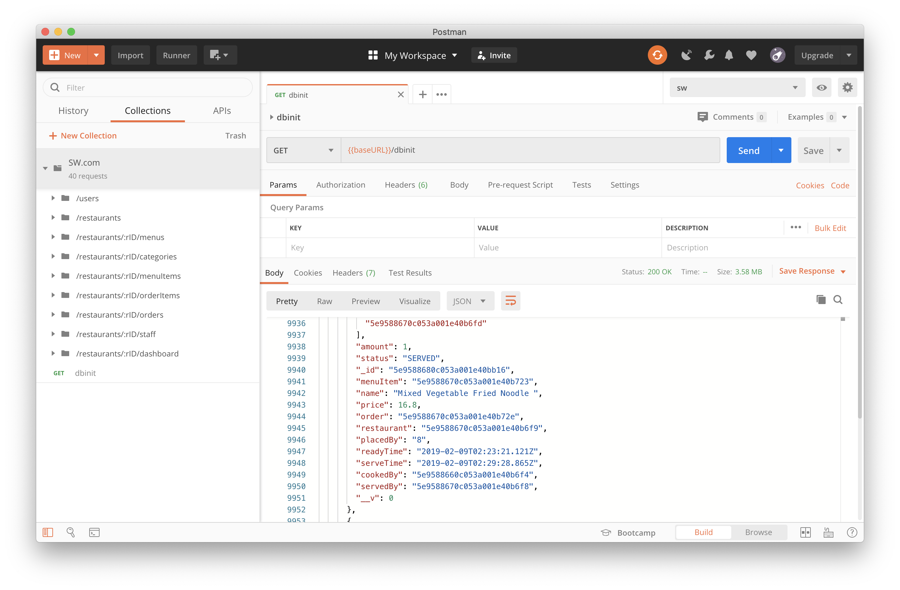
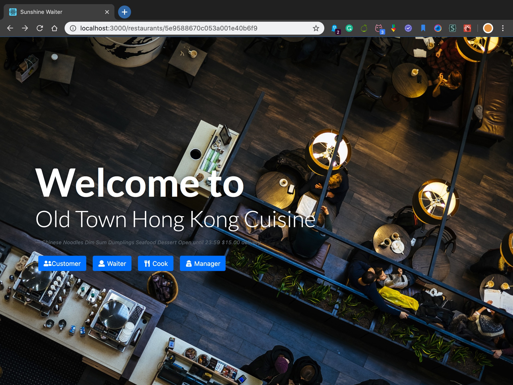

# Zitong Li's work diary

## Week1

#### Mon, 2020/2/17

Group formed.

#### Tue, 2020/2/18

Self learnt JavaScript Basics.

#### Wed, 2020/2/19

Self learnt React Basics.

#### Thu, 2020/2/20

Self learnt Html5 Basics.

## Week2

#### Mon, 2020/2/24

Responsibility assigned to every group member. I am nominated as the Scrum Master and am responsible for the frontend developing of waiter-staff part.

#### Wed, 2020/2/26

Learnt the agile SCRUM methodology and deliver the ideas and explained terminologies to the other team members.

## Week3

#### Mon, 2020/3/2

Got familiar to the Jira management system. Set up the project. Started to write poject proposal. 

#### Wed, 2020/3/4

Background investigation. Analyse the existing systems on the market.

#### Sun, 2020/3/7

Proposal finished.

## Week4

#### Tue, 2020/3/10

Learnt how to use webSocket for real-time notification. Create a demo based on socket.io.

#### Thu, 2020/3/12

Learnt applied visual design and Redux.

#### Sun, 2020/3/15

Built a waiter serving demo using socket.io.

## Week5

#### Tue, 2020/3/17

Finished Waiter page layout design.

#### Sat, 2020/3/21

Finished several major functions of waiter page, like SW-49, SW-50, SW-51. Details of these tasks are on Jira.

#### Sun, 2020/3/22

Finished request box of waiter page, UI improved.

## Week6

#### Tue, 2020/3/24

Finished web-socket functions. Now the waiter can recieve new ready dishes and send finished or failed dishes to the server.

#### Thursday, 26 March 2020

Perfect the waiter page, now different waiters of a same restaurant can share the common information and get real-time update when any events happened.

#### Friday, 27 March 2020

1. add user information for identification
2. update can only be done by the server
3. add `servedBy` attribute to the dish and `handleBy` to the request, which indicates that who did this job
4. finish button will only be visible by the `servedBy` user
5. before every button click event, the connection will be checked

#### Sunday, 29 March 2020

Merge websocket server into backend

## Week 7

Fixed bugs for web socket implementation.

#### TuesDay, 31 March 2020

Finished kitchen page 😪

#### Wednesday, 1 April 2020

Fit the kitchen and waiter page to mobile window

## Week 8

#### Saturday, 11 April 2020

Work with Jason (Yingjie Zheng) and prepared dummy data for future dashboard data visualisation

## Week 9

#### Monday, 13 April 2020

Finished basic Sales chart and time selector.

#### Tuesday, 14 April 2020

Finished dashboard, add total sales, Order amount, sales chart, category pie and best selling dishes.

#### Friday, 17 April 2020

*   Websocket server authentication finished

#### Friday, 17 April 2020

*   Restaurant page ui improve finished

    

#### Saturday, 18 April 2020

Finished pushing orders to kitchen when a customer place order.

*   dashboard bug fixed

#### Sunday, 19 April 2020

*   request api finished

    >   thanks to Jason's excellent documentation for api coding

